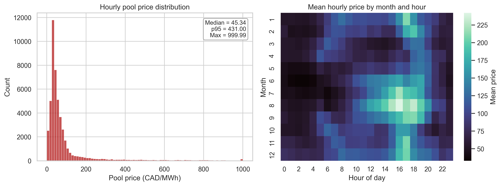
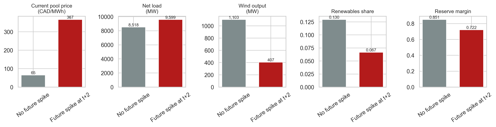
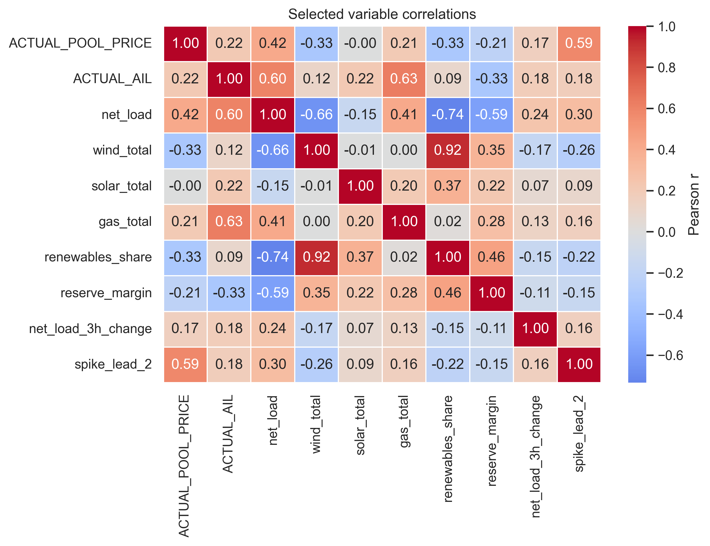
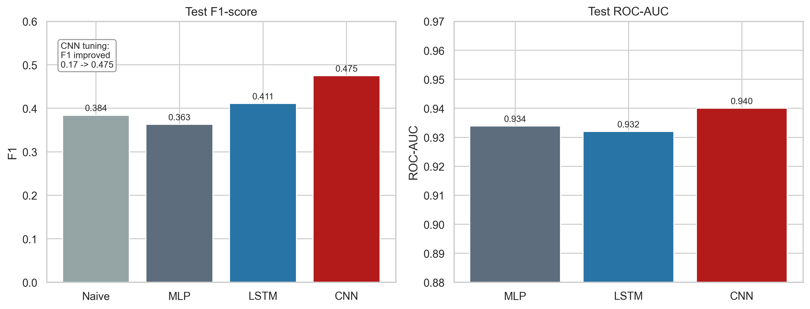

# Predicting Alberta Electricity Price Spikes: Evidence From Supply, Demand, and Renewable Conditions

Aravindh Palaniguru, Alejandro Jose Alvarado Barrera, and Jorge Gutierrez Barajas

DATA 607

April 5, 2026

## Abstract

Extreme hourly price spikes in Alberta's energy-only electricity market create operational and financial risk for market participants, which makes short-horizon spike prediction a relevant applied machine learning problem. This report evaluates whether publicly observable AESO market and generation data can classify whether the Alberta pool price will exceed CAD 200/MWh at t+2. Two public AESO datasets were merged at the hourly level and transformed into a final modeling sample of 48,839 usable observations covering January 2020 to July 2025. Exploratory analysis shows a heavy right tail in pool prices and a consistent scarcity signature: future spike hours are associated with higher current prices, higher net load, lower wind output, lower renewable share, and thinner reserve margins. Three neural-network classifiers were compared: a multilayer perceptron (MLP), a long short-term memory network (LSTM), and a one-dimensional convolutional neural network (CNN). The final submission deck reports that the tuned CNN achieved the strongest test performance (F1 = 0.475, ROC-AUC = 0.940), followed by the LSTM (F1 = 0.411, ROC-AUC = 0.932), the MLP (F1 = 0.363, ROC-AUC = 0.9339), and a naive benchmark (F1 = 0.384). The results indicate that sequence-aware neural architectures can improve short-horizon spike classification, although the gains remain modest because the task is rare-event prediction in a market whose structure changes over time.

## Background and Introduction

Alberta's wholesale electricity market is an energy-only market in which the hourly pool price is formed by the interaction of supply and demand. Because electricity cannot be stored economically at scale and system balance must be maintained continuously, periods of tight capacity, high demand, weak renewable output, or intertie stress can produce abrupt price spikes. These episodes matter for generators, large industrial consumers, retailers, and system operators because they alter dispatch incentives, hedging costs, and operating risk.

The present project asks whether public system-level information is sufficient to anticipate short-run spike risk. That question is practical as well as methodological: if a model can identify high-risk hours before scarcity pricing materializes, market participants can adapt bidding, dispatch, or load scheduling decisions accordingly. Alberta is also an attractive applied setting because its market is province-specific, publicly documented, and not as overused in classroom projects as more generic benchmark datasets.

The modeling choice is motivated by prior work showing that electricity prices are nonlinear, seasonal, and spike-prone. Lago et al. (2018) show that deep-learning methods often outperform traditional price forecasting approaches. Alberta-specific studies likewise motivate this comparison: Manfre Jaimes et al. (2023) use neural methods for multi-day price forecasting, while Zamudio Lopez et al. (2024) examine spike occurrence directly. In that context, the present report emphasizes transparent comparison across three neural architectures rather than claiming a production-ready forecasting system.

## Data Source and Preparation

The report uses two publicly available AESO datasets. The first is the Hourly Metered Volumes and Pool Price and AIL file, which provides pool price, Alberta Internal Load, and intertie flow information (Alberta Electric System Operator, 2025a). The second is the Historical Generation Data (CSD), which records hourly generation and system capability by fuel type (Alberta Electric System Operator, 2025b). Because both sources are distributed publicly by AESO, the group had permission to use them for academic analysis under the operator's public reporting framework.

The two datasets were aligned on a common hourly Mountain Prevailing Time axis, aggregated to the province level where necessary, and then merged into a unified modeling table. The final presentation summarizes 72 engineered features and no remaining missing values; the LSTM used 63 features because it omitted manual lag variables that were redundant once sequence windows were introduced. The working feature set combined current price and demand, fuel-type generation, system capability, import-export flows, reserve-margin proxies, renewable shares, lagged information, and cyclical calendar encodings.

As the project evolved, the final presentation deck superseded some earlier notebook summaries. For that reason, this report treats the submission deck as the authoritative source for the final tuned model metrics, while the source CSV is used to regenerate descriptive figures and exploratory statistics.

| Split | Period | Rows | Approximate spike rate |
| --- | --- | ---: | ---: |
| Train (70%) | Jan 2020 - Nov 2023 | 33,672 | ~10.0% |
| Validation (20%) | Nov 2023 - Dec 2024 | 9,624 | ~8.5% |
| Test (10%) | Dec 2024 - Jul 2025 | 5,543 | ~3.3% |

## Preliminary Analyses

Exploratory analysis shows that Alberta pool prices are strongly right-skewed rather than approximately Gaussian. In the source data, the median hourly price is CAD 45.34/MWh, the 95th percentile is CAD 431.00/MWh, and the observed maximum is CAD 999.99/MWh. This heavy upper tail justifies a spike classification framing rather than a narrow focus on average price behavior.

Temporal structure is also visible. Mean prices rise most sharply in late afternoon and early evening, and higher-price months cluster in the summer period. Year-level spike prevalence is similarly uneven: 2020 = 2.16%, 2021 = 9.93%, 2022 = 18.94%, 2023 = 17.59%, 2024 = 5.73%, 2025 = 1.94%. This variability indicates that the market regime is not stationary across the full sample.

The descriptive comparisons in the final deck also support a scarcity narrative. Relative to hours that are not followed by a spike, hours followed by a spike at t+2 have substantially higher current prices (CAD 366.57 versus CAD 65.02), higher net load (9,599 MW versus 8,518 MW), lower wind output (407 MW versus 1,103 MW), lower renewables share (6.7% versus 13.0%), and lower reserve margin (0.722 versus 0.851). These patterns are economically coherent because price spikes tend to emerge when dispatchable supply must absorb more load while renewable support weakens.

**Figure 1.** *Distribution and temporal structure of Alberta pool prices.*

*Note.* Left panel shows the heavy right tail in hourly pool prices. Right panel shows mean hourly prices by month and hour of day, highlighting seasonal and intraday structure.

**Figure 2.** *Mean system conditions for hours with and without a future spike at t+2.*

*Note.* Future spike hours exhibit higher current prices and net load, but lower wind output, lower renewables share, and lower reserve margin.

**Figure 3.** *Correlation matrix for selected market and system-stress variables.*

*Note.* The exploratory matrix summarizes pairwise linear association and is used only to describe structure, not to make causal claims.

## Problem Statement and Working Hypotheses

The central problem statement is whether publicly observable market and generation conditions contain enough information to identify a future price spike before it occurs. In operational terms, the presentation frames the task as a short-horizon warning problem; in the modeling pipeline itself, the binary target is whether the pool price exceeds CAD 200/MWh at t+2.

Two working hypotheses guided the analysis. First, sequence-aware models should outperform a flat multilayer perceptron because short-run ramp events and evolving system tightness are inherently temporal. Second, future spike hours should be associated with higher load pressure and lower renewable availability, which should make variables such as current price, net load, reserve margin, and wind output informative predictors of the target.

## Formal Analyses

All models were trained and evaluated with time-ordered data splits in order to avoid look-ahead bias. The final workflow used a chronological train-validation-test partition, coupled with TimeSeriesSplit cross-validation inside the pre-test horizon. Because spike hours are relatively rare, F1-score was used as the primary metric, with ROC-AUC used as a secondary measure of ranking quality.

The MLP served as the simplest baseline. It consumed an engineered tabular feature vector for each hour and relied on manually created lag terms to represent recent history. The final presentation reports that a random hyperparameter search was used to tune layer width, dropout, and learning rate, but that the model still generalized poorly out of sample.

The LSTM replaced manual temporal approximation with sequence modeling. Using a 24-hour lookback window, it carried hidden state across the sequence and was then further improved through threshold calibration. The final deck reports that this tuning increased test F1 to 0.411 and yielded recall of roughly 59%, which implies that the LSTM became materially better at recovering true spike hours even if false alarms remained a concern.

The CNN was designed to detect local spike fingerprints in recent sequences. The final presentation describes three decisive refinements: lower and better-searched class weighting, wider temporal filters that scanned longer pre-spike build-ups, and a stricter validation-based decision threshold of 0.9. Those changes lifted CNN test F1 from 0.17 in the early run to 0.475 in the final tuned version.

## Results and Interpretation

The final submission deck identifies the CNN as the strongest model overall. Its tuned test F1 of 0.475 is the best result in the project and exceeds both the LSTM (0.411) and the MLP (0.363). Importantly, it also improves on the naive benchmark reported in the presentation (0.384), even though that gain is still modest in absolute terms.

The ranking metrics tell a subtler story. All three neural networks achieve high ROC-AUC values above 0.93, which means that they distinguish risky hours from ordinary hours reasonably well before a hard classification threshold is applied. Yet the thresholded F1-scores are much lower, especially for the MLP. This gap shows that the main difficulty is not only ranking spike risk but also choosing a threshold that balances missed spikes against excessive false alarms in a highly imbalanced environment.

From an interpretive standpoint, the project supports three substantive conclusions. First, local temporal patterns matter: the CNN's advantage suggests that short-run ramp structures are more informative than longer-memory dynamics or purely flat snapshots. Second, renewables and reserve conditions matter: both the exploratory tables and the feature-importance slide indicate that current price, wind output, solar output, and system-stress indicators are central to spike risk. Third, rare-event prediction remains hard: even the best architecture only modestly outperforms a simple baseline, which is consistent with the deck's own conclusion that richer temporal structure helps, but does not solve the problem outright.

| Model | Validation F1 | Test F1 | Test ROC-AUC | Interpretive note |
| --- | ---: | ---: | ---: | --- |
| Naive benchmark | n/a | 0.384 | n/a | Reference heuristic reported in the final deck. |
| MLP | 0.5921 | 0.3630 | 0.9339 | Strong ranking ability, but weak generalization once evaluated out of sample. |
| LSTM | 0.594 | 0.411 | 0.932 | Sequence memory improved spike capture; the final deck reports about 59% recall. |
| CNN | n/a | 0.475 | 0.940 | Best overall model after class-weight tuning, wider filters, and threshold calibration. |

**Figure 4.** *Final model comparison reported in the submission deck.*

*Note.* Panel A compares test F1 across the naive benchmark and the three neural networks. Panel B compares test ROC-AUC for the neural networks; the naive benchmark has no probability-ranking analogue.

## Conclusions

This project shows that publicly available AESO data contain meaningful information about short-horizon electricity price spike risk in Alberta. The formal comparison across an MLP, an LSTM, and a CNN shows that sequence-aware neural models are preferable to a flat baseline, with the tuned CNN emerging as the best overall specification in the final submission.

At the same time, the results should be interpreted carefully. The sample exhibits pronounced class imbalance, the market changed materially over the 2020-2025 period, and the final gains over a naive benchmark remain limited. Future work should therefore extend the predictor set with weather forecasts, outage information, and offer-stack or merit-order variables, while also evaluating longer forecast horizons and cost-sensitive thresholds that better reflect operational priorities.

## Task Division

Jorge Gutierrez Barajas led the LSTM workflow, including recurrent-model configuration, threshold-tuning experiments, and interpretation of the sequence-model results. Alejandro Jose Alvarado Barrera led the CNN workflow, including convolutional architecture design, class-weight calibration, and interpretation of the final best-performing model. Aravindh Palaniguru led the MLP baseline, the initial feature-engineering workflow, and the baseline comparison logic. All three members contributed jointly to data acquisition, data cleaning, exploratory analysis, interpretation of findings, and preparation of the final presentation and report.

## References

- Alberta Electric System Operator. (2025a). Hourly metered volumes and pool price and AIL data 2001 to July 2025 [Data set]. https://www.aeso.ca/market/market-and-system-reporting/data-requests/hourly-generation-metered-volumes-and-pool-price-and-ail-data-2001-to-july-2025/

- Alberta Electric System Operator. (2025b). Historical generation data (CSD) [Data set]. https://www.aeso.ca/market/market-and-system-reporting/data-requests/historical-generation-data/

- Lago, J., De Ridder, F., & De Schutter, B. (2018). Forecasting spot electricity prices: Deep learning approaches and empirical comparison of traditional algorithms. Applied Energy, 221, 386-405.

- Manfre Jaimes, D., Zamudio Lopez, M., Zareipour, H., & Quashie, M. (2023). A hybrid model for multi-day-ahead electricity price forecasting considering price spikes. Forecasting, 5(3), 499-521.

- Saha, C. (2025). Developing a statistical risk assessment and grid prediction tool for power system reliability (Master's capstone project). University of Calgary. https://ucalgary.scholaris.ca/server/api/core/bitstreams/2660b5fd-7457-4720-b2c1-f4127a579d62/content

- Zamudio Lopez, M., et al. (2024). Forecasting the occurrence of electricity price spikes: A statistical-economic investigation study. Forecasting, 6(1), 7.
